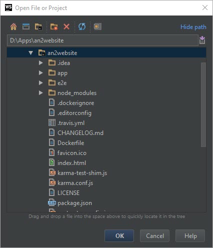

# an2website
This is my first Angular 2 Website App

##Clone the repo
Clone this repo into any folder.
```bash
git clone  https://github.com/FL4X/an2website.git
cd an2website
```

###Open project in WebStorm
Click the File>Open and choose the project folder:



###Run the app
Run the app in your browser:

```bash
npm start
```
